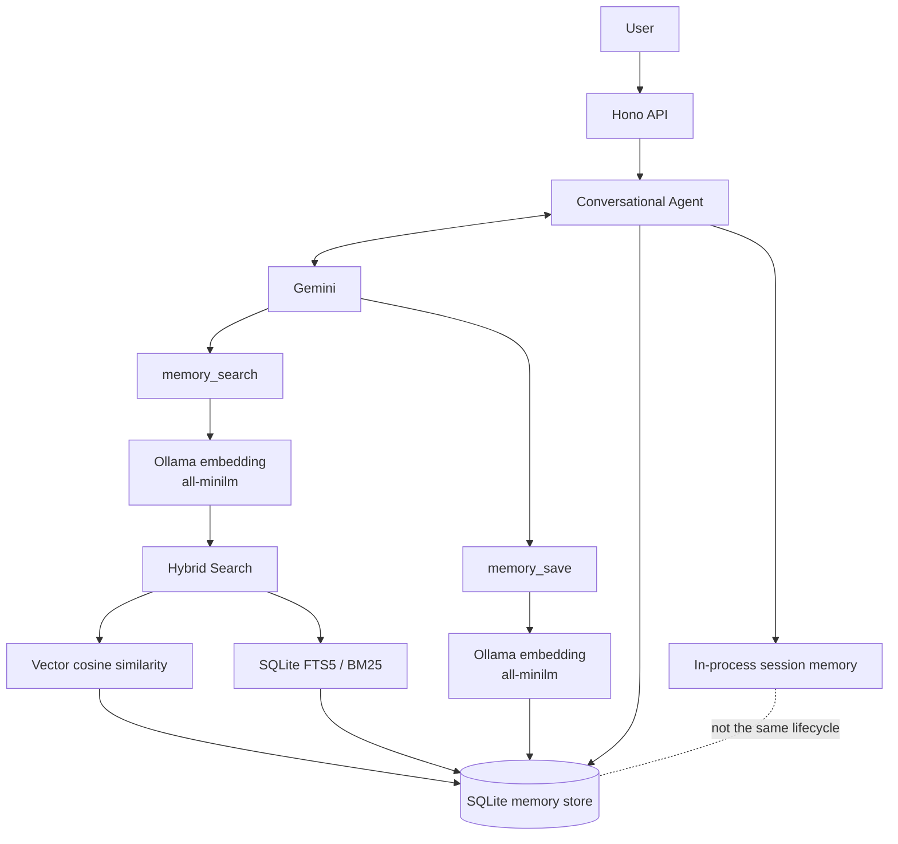

# CVS Onboarding Lab 03

## Conversational Agent with Persistent Memory

A TypeScript conversational agent that combines Gemini function calling, local Ollama embeddings, and user-scoped SQLite storage to recall durable context across independent chat sessions. A Hono HTTP API exposes health, chat, and session-reset endpoints.

## Features

- SQLite-backed persistent memory
- SQLite FTS5 full-text search with BM25 ranking
- Local Ollama embeddings using `all-minilm`
- Manual cosine-similarity calculation
- Hybrid retrieval weighted `0.7` vector and `0.3` BM25
- Independent min-max score normalization before ranking
- Gemini function calling
- Autonomous `memory_search` and `memory_save` tools
- Proactive memory bootstrap on the first turn of a new session
- Configurable semantic relevance threshold
- Session-scoped conversational state
- Persistent cross-session long-term state
- Strict `user_id` isolation for sessions and memories
- UUID session generation when `session_id` is omitted
- Hono HTTP API
- Deterministic tests with injected external-service fakes

## Architecture



`session memory != persistent memory`: session history lives only in the running process and is keyed by `session_id`; long-term memories live in SQLite, are keyed by `user_id`, and survive session reset or process restart.

## Project structure

```text
.
├── data/
│   └── .gitkeep                 # keeps the runtime-data directory, not its databases
├── scripts/
│   ├── demo-agent.ts            # live Gemini + Ollama acceptance scenario
│   ├── demo-embeddings.ts       # live Ollama embedding/retrieval demonstration
│   └── inspect-memory.ts        # local database inspection helper
├── src/
│   ├── agent/
│   │   └── conversational-agent.ts
│   ├── db/
│   │   └── memory-db.ts         # schema, FTS5/BM25, persistence, cosine search
│   ├── embeddings/
│   │   └── embeddings.ts        # provider abstraction and Ollama client
│   ├── memory/
│   │   ├── hybrid-search.ts     # normalization and weighted ranking
│   │   └── memory-tools.ts      # Gemini declarations and tool execution
│   ├── app.ts                   # dependency-injected Hono application
│   ├── config.ts                # validated environment configuration
│   └── index.ts                 # local server entry point
├── tests/                       # deterministic unit and HTTP tests
├── .env.example
├── package.json
├── package-lock.json
└── tsconfig.json
```

## Prerequisites

- Node.js >=20.19
- npm
- [Ollama](https://ollama.com/)
- A Gemini API key

## Setup

```bash
npm install
ollama pull all-minilm
cp .env.example .env
```

Set `GOOGLE_API_KEY` in the untracked `.env` file. The example contains only the placeholder `your_google_ai_api_key`.

Environment variables:

| Variable | Required | Default | Purpose |
| --- | --- | --- | --- |
| `GOOGLE_API_KEY` | Yes | none | Authenticates Gemini requests. |
| `DATABASE_PATH` | No | `./data/memories.db` | SQLite database location. |
| `OLLAMA_BASE_URL` | No | `http://localhost:11434` | Local Ollama API base URL. |
| `OLLAMA_EMBEDDING_MODEL` | No | `all-minilm` | Ollama embedding model. |
| `GEMINI_MODEL` | No | `gemini-3.1-flash-lite` | Gemini model with function-calling support. |
| `MEMORY_BOOTSTRAP_RELEVANCE_THRESHOLD` | No | `0.08` | Raw cosine threshold from `0` to `1`. |
| `PORT` | No | `8000` | Local HTTP port. |

The application reads process environment variables directly; it does not parse `.env` itself. Load the file into your shell before running:

```bash
set -a
source .env
set +a
```

Never commit `.env`.

## Running

Start Ollama, load the environment as shown above, and run the development server with restart-on-change:

```bash
npm run dev
```

Run the local server without file watching:

```bash
npm start
```

The API listens on `http://localhost:8000` by default. This repository provides a local runtime; it does not claim a hosted production deployment.

## Tests

```bash
npm run typecheck
npm test
npm run demo:embeddings
npm run demo:agent
```

`npm run typecheck` and `npm test` are deterministic. Tests inject fake Gemini models and deterministic embedding providers where external services would otherwise be called; HTTP tests use Hono's in-process request interface and do not bind a TCP port.

The two demo commands are live integration checks:

- `npm run demo:embeddings` requires Ollama and `all-minilm`.
- `npm run demo:agent` requires both Ollama and a valid `GOOGLE_API_KEY`. It uses a temporary SQLite database and removes it afterward.

Optional database inspection:

```bash
npm run inspect-memory
npm run inspect-memory -- --db :memory: --seed
```

## API

### `GET /health`

```bash
curl -i http://localhost:8000/health
```

Response (`200`):

```json
{
  "status": "ok"
}
```

### `POST /chat`

`user_id` and `message` are required nonblank strings. `session_id` is optional; when omitted, the server creates a UUID with `crypto.randomUUID()`.

Request with a supplied session:

```bash
curl -sS http://localhost:8000/chat \
  -H 'content-type: application/json' \
  -d '{"user_id":"user1","session_id":"session-1","message":"Hello"}'
```

Response (`200`):

```json
{
  "response": "Hello!",
  "session_id": "session-1"
}
```

Request with a generated session:

```bash
curl -sS http://localhost:8000/chat \
  -H 'content-type: application/json' \
  -d '{"user_id":"user1","message":"Start a new conversation"}'
```

The response contains a generated UUID in `session_id`. Reuse it for subsequent turns when conversational continuity is needed.

### `POST /chat/reset`

```bash
curl -sS http://localhost:8000/chat/reset \
  -H 'content-type: application/json' \
  -d '{"user_id":"user1","session_id":"session-1"}'
```

Response (`200`):

```json
{
  "status": "ok",
  "session_id": "session-1"
}
```

An unknown session returns `404`. A session ID owned by another user returns `409`. Validation errors return `400`; unexpected errors return a sanitized `500` envelope.

## Persistent-memory demonstration

The acceptance scenario spans two independent sessions for the same user.

Session 1 stores durable context:

```text
I prefer Python over TypeScript, and I am building a backend service.
```

A new Session 2 then asks:

```text
Can you recommend a good framework for my project?
```

Before Session 2's first Gemini call, the agent embeds the new question, retrieves relevant memories scoped to that user, applies the relevance threshold, and supplies matching memory as untrusted context. Gemini can therefore recommend a Python-aligned framework such as FastAPI using information persisted in Session 1 rather than relying on Session 1's in-memory chat history.

## User isolation

Every vector query, FTS5/BM25 query, save operation, proactive bootstrap, and session ownership check is scoped by `user_id`. A user cannot search another user's rows, reuse another user's live `session_id`, or reset another user's session.

The HTTP service trusts the caller-provided `user_id` because authentication is outside this lab's scope. A production system must derive that identifier from authenticated server-side identity rather than an arbitrary request field.

## Reset semantics

Resetting a session deletes only the in-memory conversational session state. It does **not** delete persistent SQLite memories.

Reusing the same `session_id` after a successful reset creates a fresh Gemini chat. Its first turn can proactively retrieve the user's durable memory from SQLite.

## Hybrid search

Each query is embedded locally through Ollama. Vector retrieval manually calculates cosine similarity over the user's stored vectors, while lexical retrieval uses SQLite FTS5 and BM25. Each candidate source is min-max normalized independently before scores are merged:

```text
final score =
  0.7 * normalized vector score
  + 0.3 * normalized BM25 score
```

Results absent from one source receive zero for that component. The final list is sorted by the combined score, while raw cosine similarity is retained separately for the proactive-bootstrap relevance threshold.

## Design decisions

- **Database independence:** SQLite schema, persistence, BM25 retrieval, and vector math do not depend on Ollama or Gemini.
- **Embedding abstraction:** `EmbeddingProvider` allows deterministic test doubles while the runtime uses `OllamaEmbeddings`.
- **Deterministic proactive bootstrap:** the first message in every new session triggers one explicit user-scoped search before Gemini responds, so recall does not depend solely on model-selected tool use.
- **Autonomous search remains available:** Gemini still receives the `memory_search` function declaration and can search again when the conversation requires different context.
- **Memory is data, not authority:** retrieved text is labeled as untrusted context and never as instructions. Already-persisted bootstrap results are also labeled to discourage duplicate saves.
- **Bounded tool loop:** Gemini tool execution is capped to prevent unbounded function-calling cycles.

## Security considerations

- Strict `user_id` filtering protects both vector and FTS5/BM25 retrieval paths.
- Session IDs are bound to their first user and cannot be reused or reset cross-user.
- No API keys are hardcoded or committed; `.env.example` contains a placeholder only.
- SQLite databases and WAL/SHM sidecars are ignored and not committed.
- HTTP `500` responses are sanitized and never expose exception details, stack traces, environment variables, API keys, or embeddings.
- Server-side error logging records exception metadata only; request bodies, environment dumps, credentials, and embedding values are not logged.
- Retrieved memory is explicitly treated as untrusted context, never as executable instructions.
- SQL statements use bound parameters for user-controlled values.

## Lab requirements coverage

- [x] SQLite persistent storage
- [x] SQLite FTS5 index
- [x] Local Ollama embeddings with `all-minilm`
- [x] Manual vector cosine retrieval
- [x] BM25 lexical retrieval
- [x] Normalized `0.7` vector / `0.3` BM25 hybrid search
- [x] Gemini function calling
- [x] `memory_search`
- [x] `memory_save`
- [x] Cross-session persistent recall
- [x] Session-scoped conversational state and reset
- [x] Proactive new-session memory bootstrap with relevance threshold
- [x] Hono HTTP API
- [x] UUID generation for omitted session IDs
- [x] Multi-user memory and session isolation
- [x] Deterministic tests that mock external Gemini/Ollama dependencies
- [x] Local deployment/runtime
- [ ] Hosted deployment (Railway/Render) — optional future work; intentionally not implemented in this lab pass
